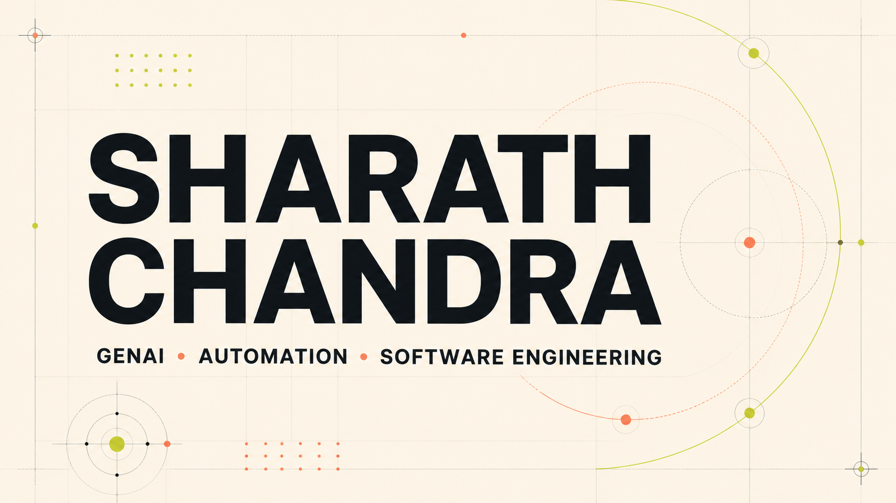

# Donthula Sharath Chandra

### Software Engineer | Applied GenAI, LLM Applications & AI Automation

[LinkedIn](https://linkedin.com/in/d-sharath-chandra) · [GitHub](https://github.com/sharath2525) · [Email](mailto:donthulasharath25@gmail.com)

## About me

I am a software engineer based in Hyderabad, India, focused on building useful generative AI products, intelligent automation, and dependable software systems. I enjoy turning real problems into practical tools—from AI-assisted workflows and browser extensions to fintech utilities and agentic systems.

At Cognizant, I support healthcare applications in a regulated production environment. My work combines incident investigation, application monitoring, data validation, release support, and automation. I am now growing toward GenAI engineering roles where I can combine this production experience with LLM applications, retrieval-augmented generation, agents, and workflow orchestration.

## What I build

- Applied GenAI products designed around real user problems
- Retrieval-augmented generation and LLM integrations
- Agentic workflows and AI-assisted automation
- Browser extensions and productivity tools
- APIs, data workflows, and production-ready software

## Featured projects

### IPO Fast Check

A mobile-first product for checking Indian IPO allotment status and following live GMP, price bands, dates, lot sizes, and estimated listing prices.

**Built with:** Next.js, TypeScript, Cheerio, server APIs, and Vercel

[Live website](https://ipoinfo.online) · [Source code](https://github.com/sharath2525/Ipoinfo)

### Claude Limit Guard

A privacy-conscious Chrome and Edge extension that displays Claude session and weekly usage limits with reset countdowns, without trackers, storage, or broad browser permissions.

**Built with:** JavaScript, Manifest V3, Claude API, Chrome, and Edge

[Chrome Web Store](https://chromewebstore.google.com/detail/claude-limit-guard/njmlhjabppkblfpcepmikdnejoehdgki) · [Source code](https://github.com/sharath2525/Claude-Limit-Guard)

### AI Context Capsule

A Chrome extension that captures ChatGPT and Claude conversations, creates structured summaries, and carries reusable context into new conversations.

**Built with:** JavaScript, Manifest V3, LLM APIs, Chrome Storage, and PDF export

[Source code](https://github.com/sharath2525/AIContextCapsule)

### Hyperliquid AI Trading Agent

A perpetual-futures research and execution system where technical signals determine direction and risk, while Claude provides structured confluence analysis before qualified trades.

**Built with:** Python, Claude, Hyperliquid, technical analysis, and risk controls

[Source code](https://github.com/sharath2525/Trading-bot)

### IQ Quiz Contest

A mobile-focused IQ quiz mini app with multiple categories, wallet-aware profiles, Base payments, timed challenges, and detailed answer breakdowns.

**Built with:** Next.js, TypeScript, Base, Farcaster, and Wagmi

[Source code](https://github.com/sharath2525/v0-iq-quiz-base-app)

## Skills

- **AI systems:** Anthropic Claude, Google Gemini, LangChain, Hugging Face, LLM integrations, and RAG concepts
- **Automation and backend:** Python, Flask, Streamlit, n8n, PowerShell, and Power Automate
- **Software and data:** JavaScript, TypeScript, React, Next.js, .NET, Oracle SQL, REST APIs, and Docker
- **Production reliability:** Linux, AWS, Git, Jira, ServiceNow, Dynatrace, incident response, testing, and release support

## Experience

### Jr. Software Engineer — Cognizant Technology Solutions

**Hyderabad, India · October 2024 — Present**

- Support healthcare applications in a GxP-regulated production environment.
- Resolve P1–P3 incidents, service requests, and problem tickets while maintaining SLA discipline.
- Use Dynatrace, application logs, alerts, transaction flows, and Oracle SQL to diagnose issues and validate data.
- Coordinate upgrades and releases, perform testing, and support post-deployment monitoring.
- Build PowerShell and Power Automate workflows that reduce repetitive operational work.
- Apply ChatGPT and Microsoft Copilot to log summarization, root-cause documentation, and first-level triage experiments.

## Education

**Bachelor of Technology in Information Technology**

Vardhaman College of Engineering, Hyderabad · 2020–2024 · CGPA 7.03

## Publication

**Personalized Mental Health Analysis Using AI**

IEEE ADICS International Conference · 2024

## Current direction

I am open to opportunities as a **GenAI Engineer**, **Applied AI Engineer**, **LLM Application Engineer**, **AI Automation Engineer**, or in **Prompt and LLM Evaluation** roles where I can build useful AI systems and help operate them reliably in production.

## Contact

- Email: [donthulasharath25@gmail.com](mailto:donthulasharath25@gmail.com)
- LinkedIn: [linkedin.com/in/d-sharath-chandra](https://linkedin.com/in/d-sharath-chandra)
- GitHub: [github.com/sharath2525](https://github.com/sharath2525)
